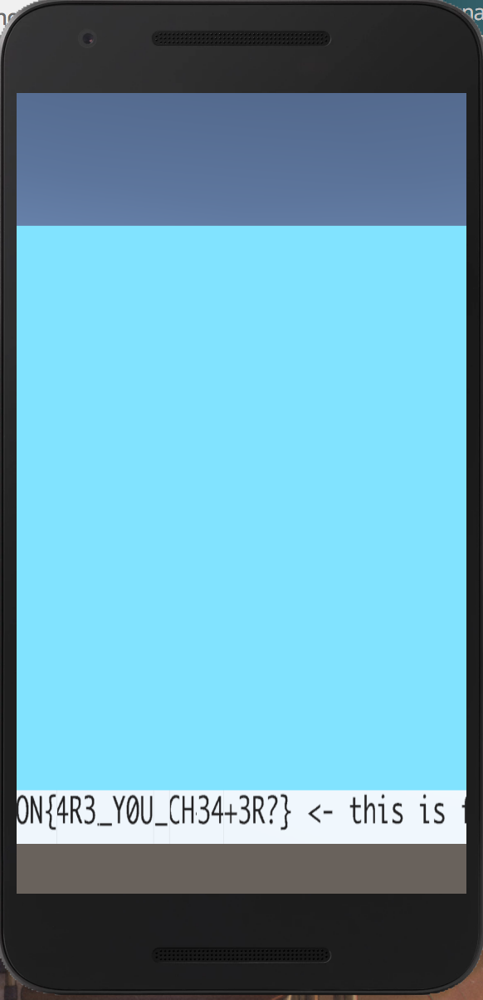
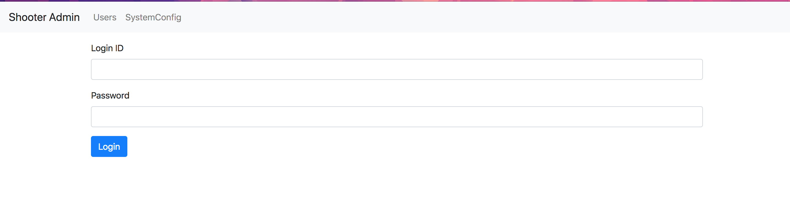

<!-- TOC -->

- [murmur](#murmur)
- [Runme](#runme)
- [Special Instructions](#special-instructions)
- [Special Device File](#special-device-file)
- [block](#block)
- [shooter](#shooter)
- [tctkToy](#tctktoy)

<!-- /TOC -->

# murmur

Thrilling to see the OSASK, I have a copy of 30日でできる! OS自作入門, which teach you  to implement a simple OS in 30 days.

# Runme

Compare the result of GetCommandLineA() to `C:\Temp\SECCON2018Online.exe" SECCON{Runn1n6_P47h}`

The flag is `SECCON{Runn1n6_P47h}`

# Special Instructions

The architecture of the elf is `moxie`, can be known by `strings`.

The binary would print :

```sh
This program uses special instructions.

SETRSEED: (Opcode:0x16)
    RegA -> SEED

GETRAND: (Opcode:0x17)
    xorshift32(SEED) -> SEED
    SEED -> RegA
```

Indeed, we can find some weird instructions in binary dump:

```
0000154a <set_random_seed>:
    154a:	16 20       	bad
    154c:	04 00       	ret

0000154e <get_random_value>:
    154e:	17 20       	bad
    1550:	04 00       	ret

00001552 <decode>:
    1552:	06 18       	push	$sp, $r6
    1554:	06 19       	push	$sp, $r7
    1556:	06 1a       	push	$sp, $r8
    1558:	06 1b       	push	$sp, $r9
    155a:	06 1c       	push	$sp, $r10
    155c:	06 1d       	push	$sp, $r11
```

Here, the implement of xorshift32 is differ from [wiki](https://en.wikipedia.org/wiki/Xorshift) ( I'll show you the reason in the next section )

```c
uint32_t xorshift32(uint32_t state[static 1])
{
    /* Algorithm "xor" from p. 4 of Marsaglia, "Xorshift RNGs" */
    uint32_t x = state[0];
    x ^= x << 13;
    x ^= x >> 17;
    x ^= x << 15; //the original version is << 5
    state[0] = x;
    return x;
}
```

Xor `flag`, `randval`, `get_random_value` to get the flag.

The flag is `SECCON{MakeSpecialInstructions}`

# Special Device File

This binary should be more easy to understand, because all you need to do is dragging it into IDA.

The key point is how `/dev/xorshift64` work, there are serveral implementation online, it's time comsuming to test everyone.

But, the SECCON is hold by japanese, where a japanese engineer would go for searching the information about things they don't understand ?

Wiki, but in japanese......

```c
x = x ^ (x << 13);
x = x ^ (x >> 7);
return x = x ^ (x << 17);
```

Again, xor `flag`, `randval`, `get_random_value` to get the flag.

The flag is `SECCON{UseTheSpecialDeviceFile}`

# block

Ｍy first time to reverse a unity game, it seems not so hard.

Decompress the `.apk`, the `C#` script of game is located at `assets/bin/Data/Managed/Assembly-CSharp.dll`.

There are only two methods ,`Start` and `Update`, obviously, the `Update` keep rotate the flag behind, let's modify them to :

```csharp
#the axis of object seems not parellel or vertical to camera

public void Start()
{
	base.transform.position = new Vector3(0f, -4.5f, 2f);
	base.transform.Rotate(new Vector3(0f, -90f, 0f));
}

public void Update()
{
}
```

Pack it back and launch it.



The flag is `SECCON{4R3_Y0U_CH34+3R?}`

# shooter

Again,a unity game.

Basically, it's arcade game, and the players would be ranked **online** with other players.

This one was builded by IL2CPP.

How I found that it was builded by IL2CPP (it's also my first time to reverse such thing):

First, there is no `Assembly-CSharp.dll`.

It may implies the possibility of 2 things (or more) :

- The `dll` was some how being packed or obfuscated
- The game was build in a different way

Second, the layout of diretory seems to be different with last challenge, block.

Then I found that there are lots of keywords in `assets/bin/Data/Managed/Metadata/global-metadata.dat`

After google it, I could dump the pseudo code from `global-metadata.dat` and `libil2cpp.so` ( main logic ) by [Il2CppDumper](https://github.com/Perfare/Il2CppDumper).

But there is nothing valuable in the game logic......

Observing strings, I found there are some weird strings :

```
shooter.pwn.seccon.jp
staging.shooter.pwn.seccon.jp
develop.shooter.pwn.seccon.jp
/admin
/api/v1/score
```

Now, I can get the highest score by sending:

```
POST /api/v1/scores HTTP/1.1
Expect: 100-continue
X-Unity-Version: 2018.2.11f1
Content-Type: application/x-www-form-urlencoded
Content-Length: 35
User-Agent: Dalvik/2.1.0 (Linux; U; Android 8.1.0; Android SDK built for x86 Build/OSM1.180201.007)
Host: shooter.pwn.seccon.jp
Connection: Keep-Alive
Accept-Encoding: gzip

score=2147483647&name=zzzzzzzzzzzzzzzzzzzzzzzz
```

It's useless, server won't send flag back.

And I don't think that the command injection would work.

Then, I found that http://staging.shooter.pwn.seccon.jp/admin will redirect you to http://staging.shooter.pwn.seccon.jp/admin/sessions/new



SQL injection works....

We can login as admin by sending `' ))) UNION (SElECT 1)#` as password.

What's more, we can do the time base SQL injection.

This part was done by [kaibro](https://github.com/w181496), my teamate.

1. leak first db : `shooter_staging`

1. leak first table in it : `ar_internal_metadata`

1. leak second table in it : `flags`

1. columns in `flags`:
   - `id`
   - `value`
   - `created_at`
   - `updated_a t`

The flag is `SECCON{1NV4L1D_4DM1N_P4G3_4U+H3NT1C4T10N}`
# tctkToy

I overdozed, only left an hour to solve this lol

By a quick glance, I guess the binary would execute an tcl script, and the goal is to build a window similar to the picture ?